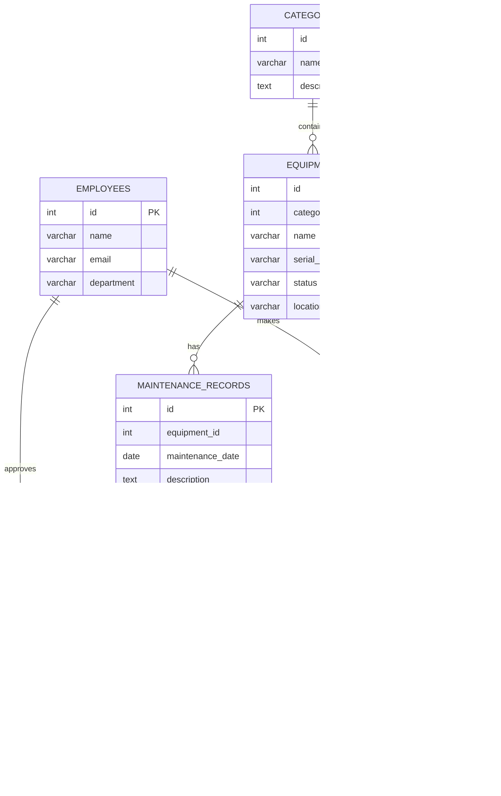

Equipment Booking System

```mermaid
erDiagram

    EMPLOYEES ||--o{ BOOKINGS :makes
    EMPLOYEES ||--o{ APPROVALS :approves
    CATEGORIES ||--o{ EQUIPMENT :contains
    EQUIPMENT ||--o{ BOOKINGS:booked
    EQUIPMENT ||--o{ MAINTENANCE_RECORDS: has
    BOOKINGS ||--o{ APPROVALS:required
   

EMPLOYEES{
    int id PK
    varchar name 
    varchar email
    varchar department
}
CATEGORIES {
    int id PK
    varchar name
    text description
}
EQUIPMENT{
    int id PK
    int category_id
    varchar name
    varchar serial_number
    varchar status
    varchar location
}
BOOKINGS{
    int id PK
    int employee_id
    int equipment_id
    date start_date
    date end_date 
    text purpose
    varchar status
}
MAINTENANCE_RECORDS{
    int id PK
    int equipment_id
    date maintenance_date
    text description
    decimal cost
    varchar status
    date completed_date
}
APPROVALS{
    int id PK
    int booking_id
    int approver_id
    varchar status
    timestamp approved_at
    text remarks
}
```