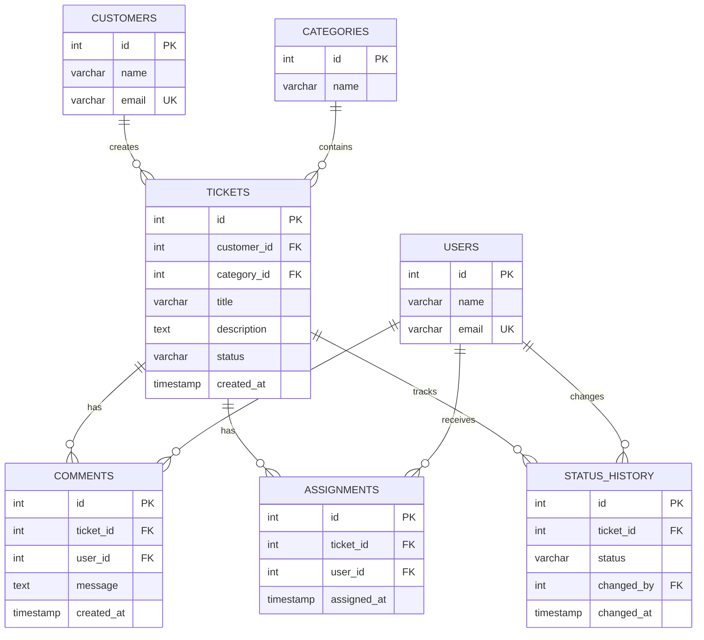
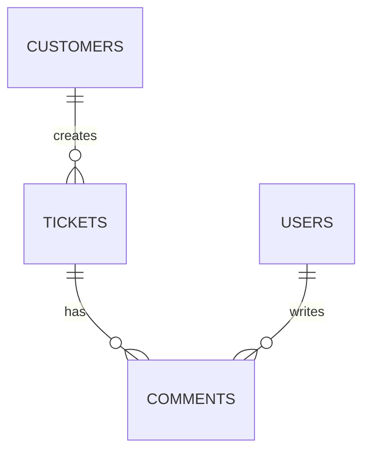

# Support Ticket Database - ER Diagram

## Entities

### Users
- id (PK)
- name
- email

### Customers
- id (PK)
- name
- email

### Categories
- id (PK)
- name

### Tickets
- id (PK)
- customer_id (FK)
- category_id (FK)
- title
- description
- status
- created_at

### Comments
- id (PK)
- ticket_id (FK)
- user_id (FK)
- message
- created_at

### Assignments
- id (PK)
- ticket_id (FK)
- user_id (FK)
- assigned_at

### Status History
- id (PK)
- ticket_id (FK)
- status
- changed_by (FK)
- changed_at


## RelationShips


## Relationships

```text
Customers
    │
    │ 1:N
    ▼
 Tickets
    │
    ├──────── 1:N ──────── Comments
    │                         │
    │                         │ N:1
    │                         ▼
    │                       Users
    │
    ├──────── 1:N ──────── Assignments
    │                         │
    │                         │ N:1
    │                         ▼
    │                       Users
    │
    └──────── 1:N ──────── Status History
                              │
                              │ N:1
                              ▼
                            Users

Categories
    │
    │ 1:N
    ▼
 Tickets


## ER Diagram




## ER Diagram

