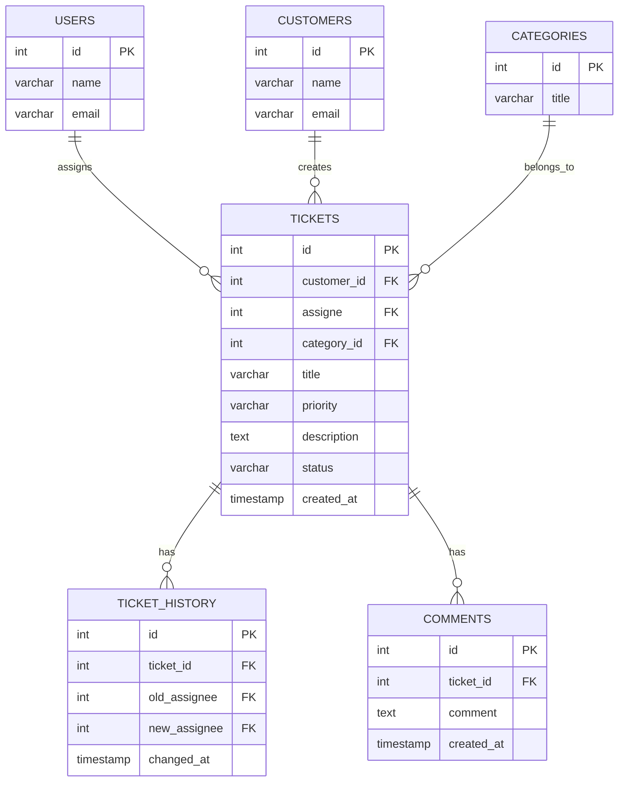

# Day 9 Database Diagram

```mermaid
erDiagram

    USERS ||--o{ TICKETS : assigns
    CUSTOMERS ||--o{ TICKETS : creates
    CATEGORIES ||--o{ TICKETS : belongs_to
    TICKETS ||--o{ TICKET_HISTORY : has
    TICKETS ||--o{ COMMENTS : has

    USERS {
        int id PK
        varchar name
        varchar email
    }

    CUSTOMERS {
        int id PK
        varchar name
        varchar email
    }

    CATEGORIES {
        int id PK
        varchar title
    }

    TICKETS {
        int id PK
        int customer_id FK
        int assigne FK
        int category_id FK
        varchar title
        varchar priority
        text description
        varchar status
        timestamp created_at
    }

    TICKET_HISTORY {
        int id PK
        int ticket_id FK
        int old_assignee FK
        int new_assignee FK
        timestamp changed_at
    }

    COMMENTS {
        int id PK
        int ticket_id FK
        text comment
        timestamp created_at
    }
```